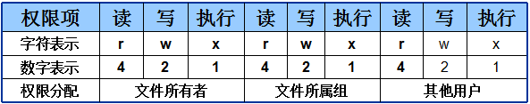

# Linux 文件权限管理命令

### 文件类型的区分

| 字符 | 文件类型 | 字符 | 文件类型     |
| ---- | -------- | ---- | ------------ |
| `-`  | 普通文件 | b    | 块设备文件   |
| d    | 目录文件 | c    | 字符设备文件 |
| l    | 链接文件 | p    | 管道文件     |

### 权限介绍

| 权限   | 符   | 数   | 文件                                         | 目录                                   |
| ------ | ---- | ---- | -------------------------------------------- | -------------------------------------- |
| 可读   | r    | 4    | 表示能够读取文件的实际内容                   | 表示能够读取目录内的文件列表           |
| 可写   | w    | 2    | 表示能够编辑、新增、修改、删除文件的实际内容 | 表示能够在目录内新增、删除、重命名文件 |
| 可执行 | x    | 1    | 表示能够运行一个脚本程序                     | 表示能够进入该目录                     |

文件的读、写、执行权限可以简写为rwx，亦可分别用数字4、2、1来表示。

文件所有者，所属组及其他用户权限之间无关联，它们的表示方式如下图所示：



#### 文件权限的数字法表示

文件权限的数字法表示基于字符表示（rwx）的权限计算而来，其目的是简化权限的表示。

若某个文件的权限为 **7** 则代表可读、可写、可执行（4+2+1）。

若权限为 **6** 则代表可读、可写（4+2）。

若权限为 **5** 则表示可读、可执行（4+1）。

若权限为 **4** 则表示==**只**==可读（对应可读权限本身：4）。

若权限为 **3** 则表示可写、可执行（2+1）。

若权限为 **2** 则表示==**只**==可写（对应可写权限本身：2）。

若权限为 **1** 则表示==**只**==可执行（对应可执行权限本身：1）。

如果一个文件的权限为：`rwxrw-r--`，使用数字法表示就是：764，表示的含义是：其所有者拥有可读、可写、可执行的权限，其文件所属组拥有可读、可写的权限；而且其他人只有可读的权限。


#### 命令

文字描述

格式：

```

```

说明：

文字描述

示例：

```shell

```

执行结果


------


#### 命令

文字描述

格式：

```

```

说明：

文字描述

示例：

```shell

```

执行结果


------


#### 命令

文字描述

格式：

```

```

说明：

文字描述

示例：

```shell

```

执行结果


------


#### 命令

文字描述

格式：

```

```

说明：

文字描述

示例：

```shell

```

执行结果


------


#### 命令

文字描述

格式：

```

```

说明：

文字描述

示例：

```shell

```

执行结果


------


#### 命令

文字描述

格式：

```

```

说明：

文字描述

示例：

```shell

```

执行结果


------


#### 命令

文字描述

格式：

```

```

说明：

文字描述

示例：

```shell

```

执行结果


------


#### 命令

文字描述

格式：

```

```

说明：

文字描述

示例：

```shell

```

执行结果


------


#### 命令

文字描述

格式：

```

```

说明：

文字描述

示例：

```shell

```

执行结果


------


#### 参考资源

- 《Linux就应该这么学》
- [Linux man命令使用方法](https://www.linuxidc.com/Linux/2017-03/142407.htm)


本文后续会随着知识的积累不断补充和更新，内容如有错误，欢迎指正。

本文最后一次更新时间：2018-07-18

------

